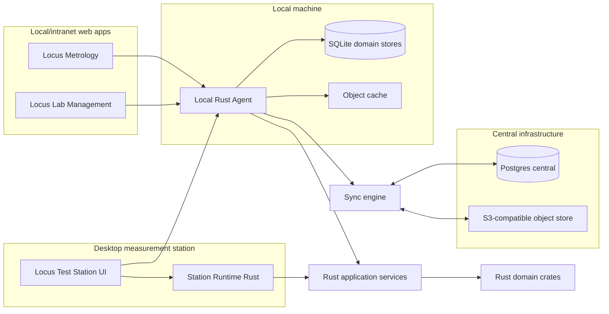
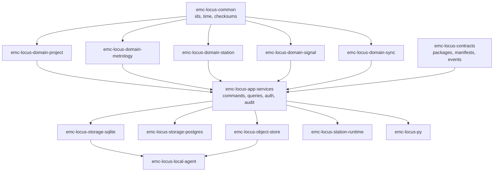
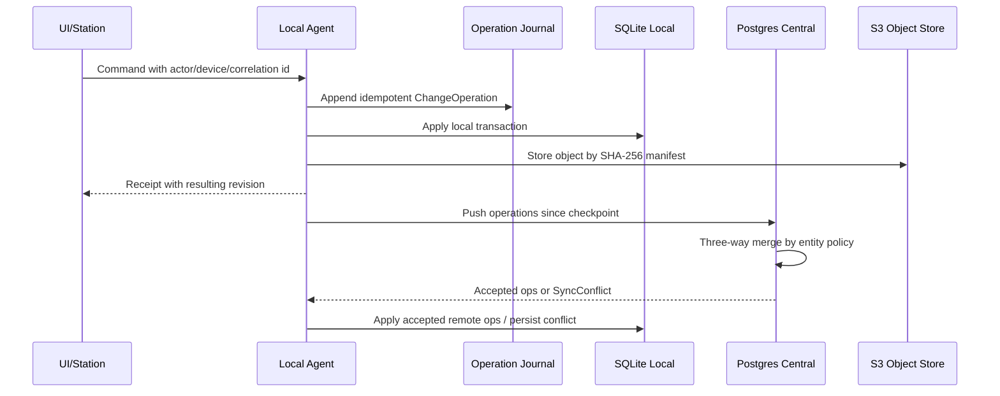
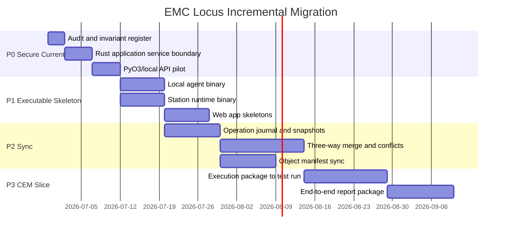
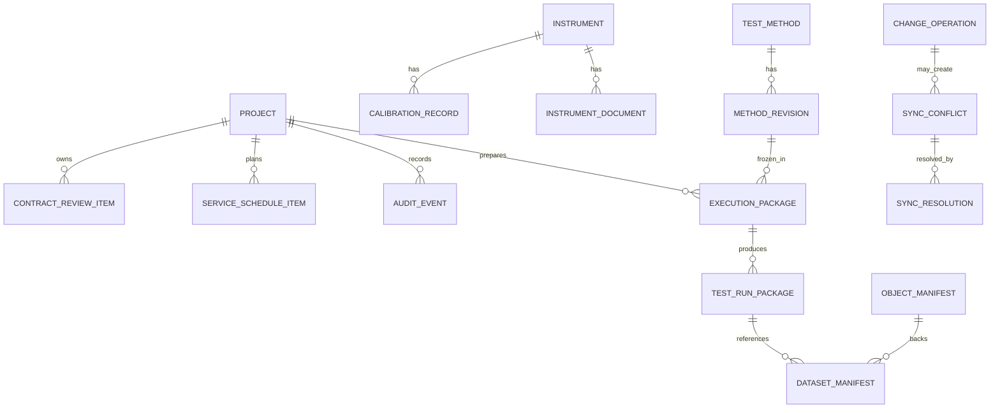
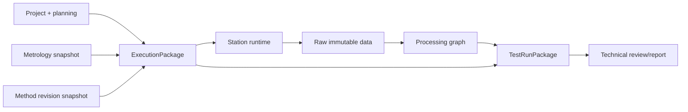

# EMC Locus Architecture Transformation Audit

## Executive Summary

EMC Locus already has a useful Rust domain core, split SQLite migrations,
Python adapters, and Qt/static UI prototypes. The next architectural move is
not a rewrite: it is to make Rust application services the controlled write
entry point, then move Python and UIs behind those services while preserving
offline-first SQLite workflows.

## Audit Initial

### Critical Files Reviewed

| Area | Files |
| --- | --- |
| Rust workspace | `Cargo.toml`, `crates/emc-locus-core/src/lib.rs` |
| Rust domains | `project.rs`, `measurement.rs`, `metrology.rs`, `repositories.rs`, `instrument.rs`, `instrument_runtime.rs`, `signal.rs`, `reporting.rs`, `updates.rs` |
| Architecture docs | `docs/architecture.md`, `docs/core-structure.md`, `docs/domain-model.md`, `docs/gui-technology.md`, `docs/offline-first-architecture.md`, `docs/instrument-control-architecture.md`, `docs/signal-acquisition-analysis.md` |
| Storage docs | `docs/storage-schema.md`, `docs/storage-migrations.md`, `storage/sqlite/**` |
| UI/adapters | `apps/lab-console/**`, `apps/qt-console/main.py`, `apps/qt-console/README.md` |
| Python services | `python/emc_locus/gui_actions.py`, `gui_bootstrap.py`, `sqlite_repositories.py`, `qt_console_models.py`, `migrations.py`, `session_plan.py` |

### Repo Cartography

| Layer | Current state | Direction |
| --- | --- | --- |
| Rust core | One crate, `emc-locus-core`, with domain primitives and tests. | Split gradually into domain crates plus application-service crates. |
| Python | Direct SQLite repositories, GUI actions, bootstrap exporter, Qt models. | Keep as adapter/UI/scripting layer, then call Rust services through PyO3 or local API. |
| Storage | Versioned SQLite domains: metrology, projects, test definitions, measurement data, update catalog, sync. | Preserve migrations while adding Postgres central and object manifests. |
| Desktop UI | PySide6 console with repository-backed forms and tables. | Keep as Test Station shell; move critical writes to Rust services. |
| Web UI | Static browser shell only. | Add local/intranet web apps for Metrology and Lab Management. |
| Sync | Rust conflict models, first contract value objects, SQLite conflict repository, operation journal, entity snapshots, and checkpoints. | Add replay, three-way merge, object sync. |

### Rust Invariants Already Present

| Domain | Existing invariant examples |
| --- | --- |
| Project | Ordered lifecycle transitions, audit events on project creation and stage advance. |
| Quality | Contract-review checklist, authorized deviations, execution-mode profiles. |
| Metrology | Instrument identity validation, calibration date/period checks, readiness blocking. |
| Measurement | Run plans consume readiness reports and reject blocking issues. |
| Runtime | Transport mismatch checks, endpoint validation, safety limit checks, observations. |
| Signal | Sample-rate/count compatibility, raw lineage, processing graph revisions. |
| Reporting | Technical review and approval gates before issue/export. |
| Updates | Signature, compatibility, rollback, offline-install, live-measurement gates. |
| Repositories/sync | Snapshot signatures, schema versions, conflict status/resolution rules. |
| Datasets | Raw data immutability, retention transitions, checksums. |

### Duplications Or Near-Duplications

| Rule | Rust source | Python duplicate/current adapter | Risk |
| --- | --- | --- | --- |
| Project stage flow | `project.rs` | `gui_actions.PROJECT_STAGE_FLOW` | Drift between UI action and domain lifecycle. |
| Contract-review gate | `quality.rs`, `project.rs` | `_missing_contract_review_items` in `gui_actions.py` | Critical quality rule duplicated outside Rust. |
| Execution modes | `quality.rs` | `PROJECT_EXECUTION_MODES` strings | Relaxation rules may diverge. |
| Update install gates | `updates.rs` | update validation SQL/Python checks | Rejection reasons can drift. |
| Dataset retention transitions | `datasets.rs` | `retention_transition_allowed` in Python | Data governance drift. |
| Instrument transport validation | `instrument_runtime.rs` | UI/SQLite mostly stores strings | Future UI could bypass Rust endpoint guards. |

### UI/Adapter Bypasses Of Rust Core

| Bypass | Current reason | Required migration |
| --- | --- | --- |
| `gui_actions.py` writes projects, metrology, scheduling, update evidence directly into SQLite. | Fast local GUI workflow and testable prototype. | Replace write path with Rust application-service commands. |
| `sqlite_repositories.py` owns many validation helpers. | No Rust storage adapter or PyO3 bridge yet. | Keep SQL adapters but validate commands in Rust before persistence. |
| Qt forms call Python actions. | PySide6 console is still Python-hosted. | PySide6 should call Rust bindings/local agent API. |
| Static browser mutates in-memory fixture state for project advance. | Workflow mockup only. | Remove write semantics or route through local API. |

## Technical Debt By Criticality

| Criticality | Area | Debt | Consequence |
| --- | --- | --- | --- |
| P0 | Architecture | No application-service Rust write boundary. | Business writes can bypass domain invariants. |
| P0 | Sync | Durable operation journal, entity snapshots, and checkpoints have started, but replay and merge policy are not implemented yet. | Offline merges remain under-specified. |
| P0 | Raw data | No object manifest/WORM contract yet. | Large files and emitted evidence are hard to prove. |
| P1 | Runtime | Runtime exists in Rust but is not separated into station binary/service. | UI can grow too much execution responsibility. |
| P1 | Metrology | Python can register/alter instruments directly. | Calibration rules can drift from Rust. |
| P1 | Planning | Planning rows are persisted but not yet validated against readiness. | Schedule can be confirmed with invalid resources. |
| P2 | Reporting | Report workflow core exists, but no package contract end-to-end. | Traceability from run to issued report is incomplete. |
| P2 | UI | Qt is still a prototype; web apps are not started. | Operator workflows remain fragmented. |
| P2 | Packaging | Local agent CLI skeleton exists, but no packaging, update service, or Windows station package. | Deployment cannot yet be controlled. |

## Architecture Cible

### Global Architecture



### Target Crate Separation



### Sync Flow



### Migration Timeline



### Logical ERD



### ExecutionPackage To TestRunPackage



## Iterative Plan P0 To P3

| Milestone | Estimate | Dependencies | Acceptance criteria | Success metrics |
| --- | ---: | --- | --- | --- |
| P0.1 Audit and invariant register | 3 d/h | Current repo | Audit doc, risk register, duplication list committed. | 100% critical files mapped. |
| P0.2 Rust application services | 5 d/h | P0.1 | Rust command/query boundary for project, contract review, metrology readiness. | Python write rules marked transitional. |
| P0.3 First PyO3/local API bridge | 5 d/h | P0.2 | Python can call one Rust command service in tests. | No duplicated stage-gate logic in Python for that path. |
| P0.4 Operation/audit log enrichment | 5 d/h | P0.2 | ChangeOperation schema, idempotency key, actor/device/correlation id. | Sync replay test green. |
| P1.1 Local agent binary | 8 d/h | P0 | Rust binary owns local SQLite path, migrations, health API. | Agent starts and serves status/query smoke tests. |
| P1.2 Station runtime binary | 8 d/h | P0 | Runtime service separated from UI, simulated run available. | UI receives runtime events without owning execution logic. |
| P1.3 Web skeletons | 8 d/h | P1.1 | Metrology and Lab Management local web shells. | Basic CRUD/query through agent API. |
| P2.1 Operation journal/snapshots | 10 d/h | P1 | EntitySnapshot and ChangeOperation persisted. | Idempotent replay tests. |
| P2.2 Merge/conflict engine | 15 d/h | P2.1 | Three-way merge policies and conflict UI data. | Conflict fixtures deterministic. |
| P2.3 Object manifest sync | 10 d/h | P2.1 | SHA-256 manifests, multipart resume design, dedupe by hash. | Object restore test verifies checksum. |
| P3.1 Vertical CEM slice | 15 d/h | P2 | Project to ExecutionPackage to simulated run. | End-to-end fixture produces package. |
| P3.2 Report and return sync | 12 d/h | P3.1 | Technical review, report package, sync return. | Audit chain complete. |

## Data Contracts

### ExecutionPackage Example

```json
{
  "schema_version": "execution-package.v1",
  "package_id": "execpkg-CEM-2026-001-A",
  "project_code": "CEM-2026-001",
  "execution_mode": "accredited",
  "method_revision": {
    "method_code": "EN61000-4-6-CS",
    "revision": "A",
    "checksum": "sha256:aaaaaaaaaaaaaaaaaaaaaaaaaaaaaaaaaaaaaaaaaaaaaaaaaaaaaaaaaaaaaaaa"
  },
  "metrology_snapshot_id": "snap-metrology-2026-06-29",
  "planned_window": {
    "start_utc": "2026-07-01T07:00:00Z",
    "end_utc": "2026-07-01T10:00:00Z"
  },
  "actor_id": "operator.one",
  "device_id": "station-lab-a",
  "correlation_id": "corr-20260701-001",
  "checksum": "sha256:bbbbbbbbbbbbbbbbbbbbbbbbbbbbbbbbbbbbbbbbbbbbbbbbbbbbbbbbbbbbbbbb"
}
```

### TestRunPackage Example

```json
{
  "schema_version": "test-run-package.v1",
  "run_package_id": "testrun-RUN-001",
  "execution_package_id": "execpkg-CEM-2026-001-A",
  "run_reference": "RUN-001",
  "started_at_utc": "2026-07-01T07:12:00Z",
  "completed_at_utc": "2026-07-01T07:44:00Z",
  "raw_datasets": ["dataset-raw-current-l1"],
  "processing_graph_instances": ["graph-inrush-fft-A"],
  "verdict": "requires_review",
  "observation_log_checksum": "sha256:cccccccccccccccccccccccccccccccccccccccccccccccccccccccccccccccc",
  "checksum": "sha256:dddddddddddddddddddddddddddddddddddddddddddddddddddddddddddddddd"
}
```

### ObjectManifest Example

```json
{
  "schema_version": "object-manifest.v1",
  "object_id": "obj-sha256-raw001",
  "logical_path": "projects/CEM-2026-001/RUN-001/raw/current_l1.h5",
  "media_type": "application/x-hdf5",
  "size_bytes": 32768,
  "checksum": "sha256:eeeeeeeeeeeeeeeeeeeeeeeeeeeeeeeeeeeeeeeeeeeeeeeeeeeeeeeeeeeeeeee",
  "storage_class": "local-first",
  "worm_locked": true,
  "created_at_utc": "2026-07-01T07:12:01Z"
}
```

### ChangeOperation Example

```json
{
  "schema_version": "change-operation.v1",
  "operation_id": "op-01J2-CEM-001",
  "entity_type": "project",
  "entity_id": "CEM-2026-001",
  "base_revision": "rev-0004",
  "resulting_revision": "rev-0005",
  "operation_kind": "contract_review_item_completed",
  "actor_id": "quality.lead",
  "device_id": "station-lab-a",
  "correlation_id": "corr-20260701-001",
  "occurred_at_utc": "2026-07-01T06:55:00Z",
  "payload_checksum": "sha256:ffffffffffffffffffffffffffffffffffffffffffffffffffffffffffffffff"
}
```

## File And Object Strategy

| Data kind | Format | Notes |
| --- | --- | --- |
| Time-series raw DAQ | HDF5 | Chunk by channel/time segment; immutable once run closes. |
| Frequency sweeps/results | Parquet | Columnar limits, traces, correction curves, verdict inputs. |
| Reports/certificates/docs | Object store | PDF, DOCX, XLSX, images with object manifests and SHA-256. |
| Metadata | SQLite local/Postgres central | References object ids, revisions, checksums, actors. |

Conventions:

- Object keys: `domain/entity/revision/file`.
- Checksums: SHA-256 on every immutable object and package manifest.
- Multipart upload: part hashes plus final manifest; resume from completed part map.
- Deduplication: content-addressable cache keyed by SHA-256.
- WORM: logical lock on approved reports, emitted packages, raw datasets, and
  accepted calibration certificates.

## Sync And Merge Strategy

| Option | Pros | Cons | Use |
| --- | --- | --- | --- |
| SQLite Session | Low-level DB diff support. | Hard to express business policy. | Possible adapter implementation detail. |
| Custom operation journal | Business semantic, idempotent, auditable. | More code to write. | Preferred source of truth. |
| Pure DB replication | Simple for central clones. | Weak offline conflict semantics. | Not enough for field stations. |

| Merge policy | Good for | EMC Locus use |
| --- | --- | --- |
| Field-level | Non-critical metadata. | Contact details, planning notes. |
| Set-union | Append-only facts. | Audit events, observations, operation logs. |
| Immutable append | Raw evidence. | Datasets, issued reports, certificates. |
| Revision fork | Controlled documents. | Methods, report templates. |
| Manual review | Quality-critical conflicts. | Metrology, verdict, project stage. |

Last-write-wins is only acceptable for non-critical cached UI state. Business
entities require three-way merge, revision trees, or manual review with an
audit reason.

## UI Migration Comparison

| Option | Productivity | Desktop maturity | Packaging | Fit |
| --- | --- | --- | --- | --- |
| PySide6 + Rust backend | High now | High | Manageable on Windows | Best bridge from current repo. |
| CXX-Qt/QML + Rust backend | Medium | High | More build complexity | Good later for native Rust-heavy UI. |
| Slint + Rust | Medium | Growing | Simpler Rust packaging | Candidate for focused station panels, less proven for dense lab UI. |

## Risk Register

| Risk | Severity | Mitigation |
| --- | --- | --- |
| Python write path remains authoritative too long | High | Move one command at a time behind Rust services and tests. |
| Sync is added as raw DB replication | High | Introduce ChangeOperation before Postgres sync. |
| Object storage lacks WORM semantics | High | ObjectManifest plus logical locks before reports/raw data production. |
| UI grows runtime logic | Medium | Station runtime binary emits events; UI consumes only. |
| Crate split too early | Medium | Add modules/services first, split crates once boundaries stabilize. |
| Proprietary BAT-EMC influence | High | Use only public concepts and original UX/data models. |

## PR Bundle 1 - Audit And Rust Application Service Boundary

Objective: document the target architecture and introduce the first Rust
application-service boundary without breaking Python/SQLite/Qt.

Files changed in this bundle:

- `docs/architecture-transformation-audit.md`
- `docs/adrs/0001-rust-application-services.md`
- `crates/emc-locus-core/src/application_services.rs`
- `crates/emc-locus-core/src/lib.rs`
- `crates/emc-locus-core/src/project.rs`
- `crates/emc-locus-core/src/quality.rs`
- `crates/emc-locus-core/src/error.rs`
- `crates/emc-locus-core/src/tests.rs`

Invariant impact:

- Keeps project lifecycle and audit evidence in Rust.
- Adds mode-specific contract-review requirements to Rust instead of Python.
- Does not remove existing Python adapters; marks them as transitional.
- Keeps SQLite migrations compatible.

## PR Bundle 2 - Sync Operation Contracts And Journal

Objective: make local-first changes durable and replayable at the contract
level before adding a central merge engine.

Files changed in this bundle:

- `crates/emc-locus-core/src/contracts.rs`
- `crates/emc-locus-core/src/error.rs`
- `crates/emc-locus-core/src/lib.rs`
- `crates/emc-locus-core/src/tests.rs`
- `storage/sqlite/sync/0002_operation_journal.sql`
- `python/emc_locus/sqlite_repositories.py`
- `python/tests/test_sqlite_repositories.py`
- `docs/core-structure.md`
- `docs/storage-migrations.md`

Invariant impact:

- Requires full `sha256:` payload checksums for Rust contract manifests and
  journaled sync operations.
- Records local operations with base and resulting revisions instead of
  overwriting current state blindly.
- Keeps operation recording separate from conflict resolution and future merge
  policy.
- Does not introduce central replication yet; replay, snapshot persistence, and
  three-way merge remain future P0/P1 work.

## PR Bundle 3 - Entity Snapshots And Sync Checkpoints

Objective: persist local replay baselines and peer cursors so the future sync
engine can compare revisions instead of relying only on operation rows.

Files changed in this bundle:

- `storage/sqlite/sync/0003_entity_snapshots.sql`
- `python/emc_locus/sqlite_repositories.py`
- `python/tests/test_sqlite_repositories.py`
- `crates/emc-locus-core/src/tests.rs`
- `docs/storage-migrations.md`

Invariant impact:

- Requires full SHA-256 snapshot checksums before a snapshot can be persisted.
- Enforces one snapshot per domain/entity/revision tuple.
- Adds peer/domain/direction checkpoints without claiming conflict-free merge.
- Keeps replay and central synchronization as explicit future work.

## PR Bundle 4 - Local Operation Replay

Objective: create the first local replay step by turning a pending operation
into a resulting entity snapshot inside one SQLite transaction.

Files changed in this bundle:

- `python/emc_locus/sqlite_repositories.py`
- `python/tests/test_sqlite_repositories.py`
- `docs/storage-migrations.md`

Invariant impact:

- Prevents a replayed operation from creating a second snapshot after it is no
  longer pending.
- Preserves transactionality between snapshot insertion and operation status.
- Keeps merge/conflict policy out of this helper; it only materializes a known
  local operation result.

## PR Bundle 5 - Snapshot Divergence Conflict Fixture

Objective: turn divergent local/reference snapshots into explicit sync
conflicts without silently choosing a winner.

Files changed in this bundle:

- `python/emc_locus/sqlite_repositories.py`
- `python/tests/test_sqlite_repositories.py`
- `docs/storage-migrations.md`

Invariant impact:

- Requires snapshots to describe the same domain/entity before conflict
  creation.
- Avoids conflict creation when checksums are identical.
- Stores local/reference snapshot ids in the existing conflict table for later
  manual or policy-based resolution.

## PR Bundle 6 - Conflict Action Plan Suggestion

Objective: create an audit-visible suggested action for an open sync conflict
without resolving it automatically.

Files changed in this bundle:

- `python/emc_locus/sqlite_repositories.py`
- `python/tests/test_sqlite_repositories.py`
- `docs/storage-migrations.md`

Invariant impact:

- Keeps open conflicts open until a deliberate resolution path is applied.
- Reuses an existing unapplied plan for idempotent suggestion calls.
- Maps checksum/concurrent conflicts to manual merge, while deletion/schema
  conflicts are deferred for review.

## PR Bundle 7 - Local Agent Executable Skeleton

Objective: introduce the first Rust executable that will become the owner of
local SQLite lifecycle, health checks, synchronization, and future local API
hosting.

Files changed in this bundle:

- `Cargo.toml`
- `Cargo.lock`
- `crates/emc-locus-agent/Cargo.toml`
- `crates/emc-locus-agent/src/lib.rs`
- `crates/emc-locus-agent/src/main.rs`
- `docs/local-agent.md`
- `README.md`

Invariant impact:

- Keeps the first agent command read-only.
- Reuses Rust repository-domain vocabulary from `emc-locus-core`.
- Avoids adding network/API behavior before local storage ownership is ready.

## Acceptance Checklist

- [ ] Rust application services own critical write command validation.
- [ ] Python write actions call Rust services or are explicitly transitional.
- [ ] Local agent owns local SQLite lifecycle.
- [ ] Station runtime owns execution logic.
- [ ] Raw data and emitted packages are immutable by manifest.
- [ ] Sync uses idempotent business operations with base/resulting revisions.
- [ ] Conflicts never rely on last-write-wins for critical entities.
- [ ] Vertical CEM slice produces ExecutionPackage and TestRunPackage evidence.
