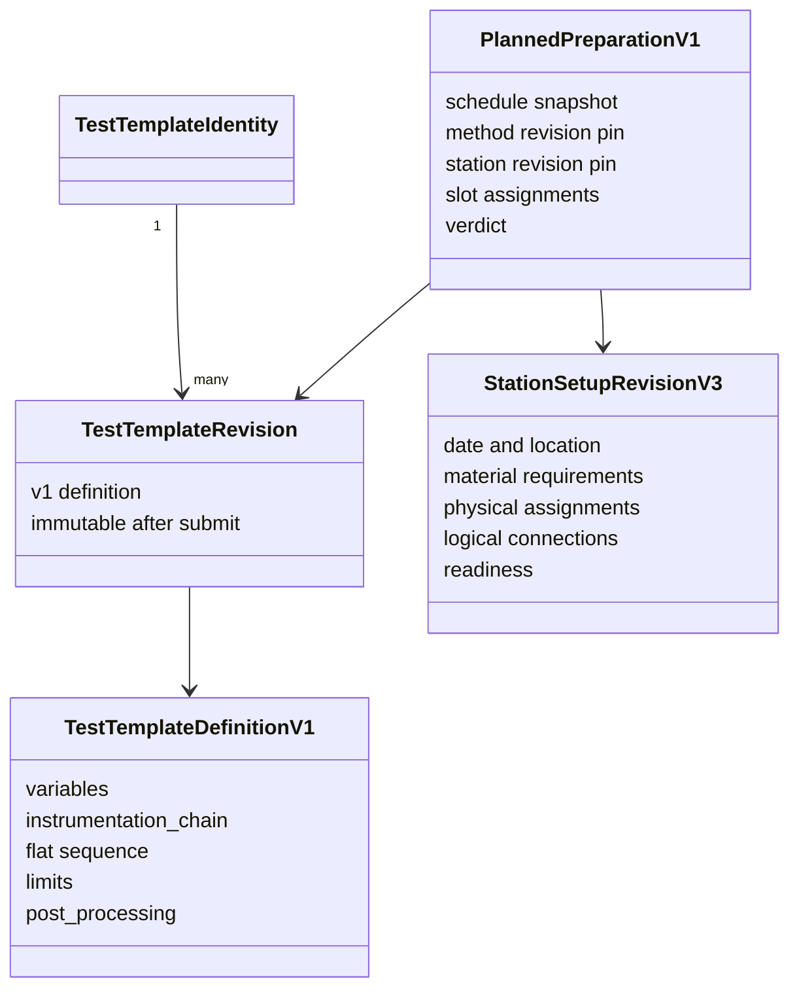
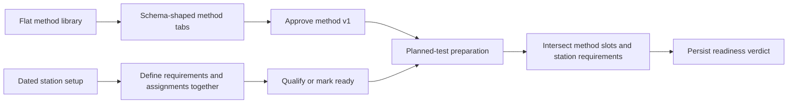
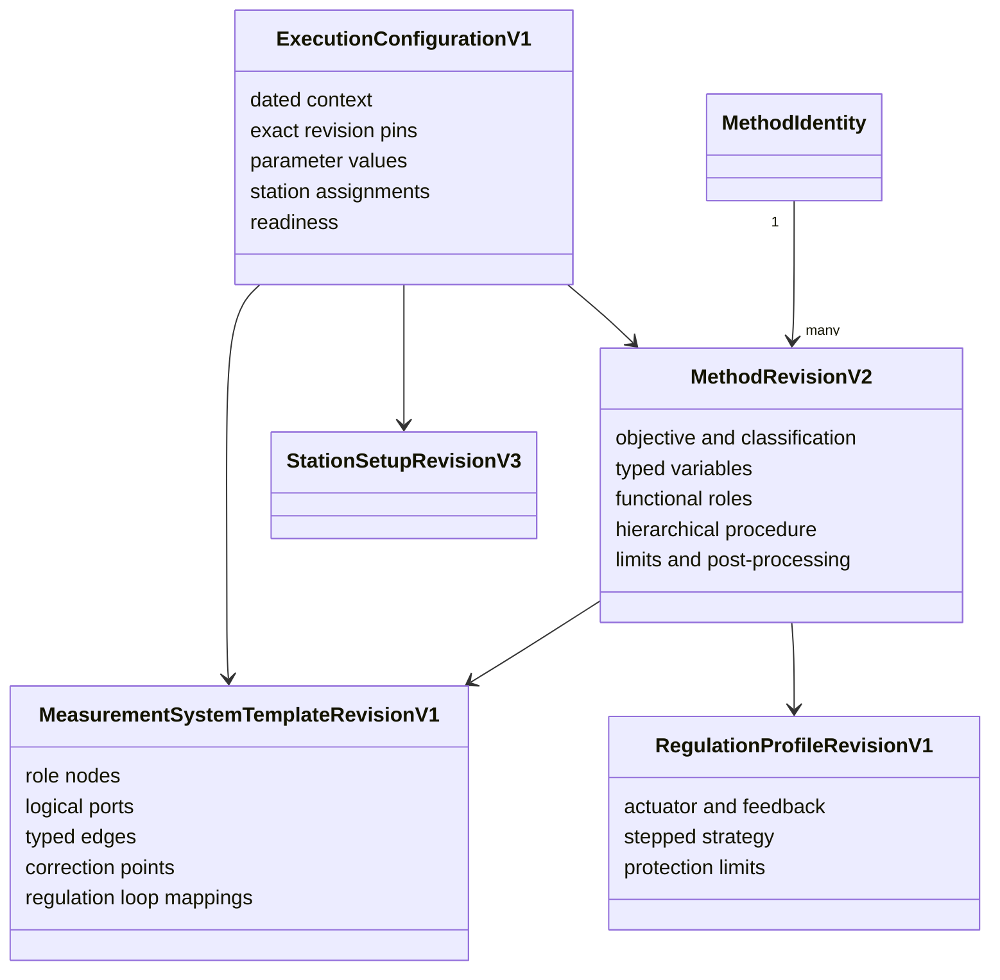

# 0.22.2 method, station and execution workflow audit

Date: 2026-08-05

## Scope inspected

The audit covered the Rust core contracts, canonicalization and validators;
SQLite migrations; Local Agent DTOs, repositories, services and routes; LAB
CONSOLE method library/editor; station setup v2/v3; planned-test preparation;
equipment capabilities, driver and correction evidence; Python/Qt read models;
fixtures, seeds, API documentation and release screenshots.

## Current-state object model

## Current operator workflow

The preparation service is the strongest existing boundary. It loads source
records itself, pins immutable revisions, intersects requirements, creates an
immutable assessment revision, and writes audit/outbox atomically.

## Findings by domain

### Test method v1

- The Rust core owns typed primary structures and deterministic SHA-256
  canonicalization.
- Variables have basic type/default/range semantics but no business category,
  source phase, derived expression or dependency graph.
- `instrumentation_chain` is a flat list of slots with category/capability and
  calibration/substitution policy.
- The sequence is ordered and branchable but not hierarchical. Cycles can be
  flagged per branch, with no bounded-loop contract.
- Limits mix time, frequency and scalar concepts without separating safety,
  instrument protection, procedure acceptance or final verdict contribution.
- Post-processing is typed at operation-kind level but inputs/outputs are free
  strings and parameters remain controlled JSON maps.
- `method_parameters` is a generic JSON map with no execution consumer.
- The revision aggregate, optimistic concurrency, audit and outbox are sound
  and should be reused.

### LAB CONSOLE method authoring

- The library is a flat card collection filtered by category/status.
- The editor mirrors schema sections: General, Variables, Policies,
  Instrumentation, Sequence, Limits, Post-processing, Revisions, Audit, JSON.
- Raw values such as category codes, slot categories, capability codes and
  several enum values are editable or visible in normal mode.
- There is no guided completion model, hierarchy, role mapping, topology,
  regulation preview, sub-range editor or execution-plan preview.
- JSON is a normal tab rather than a technical disclosure.
- Primary content loading uses broad `Promise.all` calls, so secondary history
  or audit failures can prevent opening otherwise readable method content.

### Station setup v2/v3

- v3 correctly separates `material_requirements` and physical
  `material_assignments` and preserves authoritative model/asset/port pins.
- Candidate evaluation and operational readiness are authoritative in Rust.
- Requirements support category, capability and exact-asset selection.
- Logical ports exist and are resolved only after a physical assignment.
- The same definition also requires planned date, laboratory location and mode;
  it is therefore a dated operational realization, not a reusable topology.
- Logical connections have no typed edge kind, layer or explicit feedback-loop
  semantics.
- v2 and v3 checksums are protected and must remain unchanged.

### Planned-test preparation v1

- Owns dated schedule context and immutable method/station snapshots.
- Reuses station material assignments and readiness rather than duplicating
  them.
- Intersects method slots with station requirements, but the overlap is lossy
  because method slots are less expressive than station v3 requirements.
- Does not pin a reusable topology revision, parameter profile, sub-range
  selection or sequence variant.
- This aggregate is the correct evolution point for execution configuration.

### Equipment, drivers and corrections

- Approved model revisions are already authoritative for capabilities, ports
  and communication interfaces.
- Approved driver profiles already expose actions used by station candidate
  evaluation.
- Correction requirements and serial-specific assignments are separate and
  authoritative.
- `emc_receiver` and `spectrum_analyzer` are separate operator categories under
  `measurement_instruments_digitizers`; historical references exist across
  models, assets, station fixtures and method slots.
- Consolidation therefore requires aliases and projections, not mutation of
  immutable revisions.

### Python and Qt

- Python provides presentation helpers for station v3 and the Qt console
  consumes those read models.
- Neither surface has method v2, topology, regulation or execution-plan
  projections.
- They must consume Local Agent projections and must not implement graph,
  expression, unit or compatibility rules independently.

## Duplicated concepts

| Current concepts | Problem | 0.22.2 owner |
| --- | --- | --- |
| Method slot and station material requirement | Divergent capability and policy shapes | Method functional role plus explicit topology-role mapping |
| Station logical connection and future reusable path | Dated definition carries reusable knowledge | Measurement-system template |
| Slot assignment and station assignment | Two identifiers for one physical decision | Existing station/preparation assignment engine |
| Branch condition strings and derived values | Expressions have no shared validation | Constrained unit-aware expression contract |
| Limit attention rule and runtime blocker | Safety and verdict meanings are mixed | Typed classified limit rule |

## Information in the wrong lifetime

- Date, location and current mode correctly belong to station/preparation, but
  prevent station v3 from acting as a reusable topology.
- Reusable path connections currently live in the dated station definition.
- Method v1 does not yet contain physical asset IDs, which is correct and must
  remain invariant.
- Current calibration, reservation and correction readiness correctly remain
  outside reusable methods.

## Frontend-only or unexplained behavior

- UI normalization supplies missing arrays and defaults but does not own core
  validation.
- The method editor presents internal values without explanations.
- Several disabled buttons rely on discoverability rather than adjacent
  prerequisite text.
- The station UI can connect roles in a generated order; the backend validates
  integrity, but the operator cannot express typed path intent.
- Fields such as generic method parameters and arbitrary post-processing
  parameters have no explicit runtime consumer or support status.

## Target object model

## Target workflow

## Contract decisions

- Introduce a test-method definition v2 successor while retaining the existing
  revision aggregate and API identity.
- Introduce first-class revisioned measurement-system templates and regulation
  profiles.
- Extend planned preparation with an execution-configuration successor rather
  than a competing assignment aggregate.
- Use deterministic, declarative expression ASTs; never execute arbitrary
  JavaScript, Python, shell or user code.
- Keep graph and unit validation in Rust. TypeScript renders projections and
  submits commands only.
- Store full canonical definitions and checksums in revision tables. Store
  relationship columns only for indexing and foreign-key integrity.
- Use additive category aliases for receiver/analyzer consolidation.

## Migration and compatibility risks

- Legacy method slots cannot always infer topology. Conversion must create
  functional roles and leave topology mapping as reviewed evidence.
- Station v3 date/location cannot be removed without breaking historical
  checksums; reusable templates must be separate objects.
- Existing preparation rows must remain v1 and readable. New execution
  configuration pins must be optional for historical revisions and mandatory
  for the successor schema.
- Category aliases must resolve for reads and matching while preserving old
  codes in immutable model definitions.
- Feedback cycles are valid only when explicitly modeled as regulation loops;
  generic graph-cycle rejection would incorrectly reject legitimate systems.

## Non-goals confirmed

0.22.2 validates, previews and compiles contracts. It does not send commands,
acquire samples, execute FFT, apply runtime corrections, issue final reports,
authenticate users or synchronize distributed stores.

